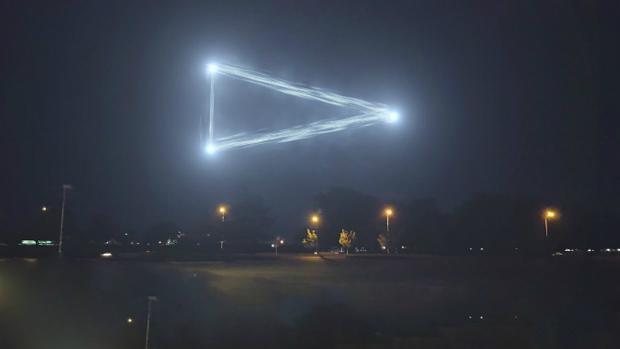

## Introducción
> - Paises donde se han producido avistamientos
> - Formas de OVNIS más frecuentes
> - Duración de los avistamientos
> - Distribución del tiempo entre el momento del avistamiento y la fecha de publicación
> - Distribución de avistamientos en el tiempo


```{r echo=FALSE, error=FALSE, warning=FALSE, message=FALSE}
library(plyr)
library(gdata)
library(stringr)
library(httr)
library(lubridate)

countries_file <- "dat/countries.csv"
file_path <- "dat/ufos.csv"

ufos_df <- read.csv(file = file_path, header = TRUE, stringsAsFactors = FALSE)
countries_df <- read.csv(file = countries_file, header= TRUE, stringsAsFactors = FALSE, na.strings = "")
countries_df <- countries_df[complete.cases(countries_df),c("country_iso_code", "country_name")] 

getCountryName <- function(code){
  code <-  toupper(code)
  if(str_length(code) > 0){
    country <- countries_df[countries_df$country_iso_code == code, "country_name"]
    country
  } else {
    "Unknown"
  }
}

colnames <- c("date", "city", "state", "country", "shape", "duration", "coments", "date_posted", "latitude", "longitude")
ufos_df <- subset(ufos_df, select = -duration..hours.min.)
colnames(ufos_df) <- colnames
#Convert types
ufos_df$date <- as.Date(ufos_df$date, "%m/%d/%Y %H:%M")
ufos_df$date_posted <- as.Date(ufos_df$date_posted, "%m/%d/%Y")
ufos_df$duration <- as.numeric(ufos_df$duration) / 60 # minutes
ufos_df$shape <- as.factor(trim(ufos_df$shape))
ufos_df$country <- sapply(ufos_df$country, getCountryName)

##Delete no complete cases
ufos_df <- ufos_df[complete.cases(ufos_df),]

#Delete rows with duration over 20 minutes
ufos_df <- ufos_df[ufos_df$duration < 20, ]
```

## Localización de avistamientos

Mayor número de avistamientos: en EEUU
```{r}
count(ufos_df, "country") 
```

## Formas de OVNIS más frecuentes

Forma de OVNI que más se avistó: en forma de luz.
```{r echo=FALSE}
f_shape <- count(ufos_df, "shape")

f_shape[max(f_shape$freq)==f_shape$freq,]

```



## Duración de los avistamientos
<small>Se han omitido avistamientos superiores a 20 minutos</small>

```{r echo=FALSE}
summary(ufos_df$duration)
hist(ufos_df$duration, col = "blue", xlab = "Duración(Minutos)", ylab= "Frequencia", main="Duración de avistamiento")
```

# Momento del avistamiento / fecha de publicación
## Histograma
```{r echo=FALSE}
ufos_df$difference_time <- as.numeric(ufos_df$date_posted - ufos_df$date)
ufos_df <- ufos_df[which(ufos_df$difference_time < 100 & ufos_df$difference_time >= 0),]
summary(ufos_df$difference_time)
hist(ufos_df$difference_time, col = "blue", xlab = "Diferencia de fechas(Días)", ylab= "Frequencia", main = "Diferencia entre avistamiento y publicación del mismo")
```

# Avistamientos en el tiempo

## Distribución de avistamientos en el tiempo
```{r echo=FALSE}
ufos_df$year <- year(ufos_df$date)
df_count <- count(ufos_df, "year") 

plot(x = df_count$year, y= df_count$freq, type="l", xlab = "Año", ylab= "Frecuencia")
```